# 😎 Task 2: Create database and table in your MySQL server
  

1. Create a new database named website. 
 
 
2. Create a new table named member, in the website database, designed  
 
 
  

# 😎 Task 3: SQL CRUD
  

1. INSERT a new row to the member table where name, username and password must be set to test. INSERT additional 4 rows with arbitrary data. 
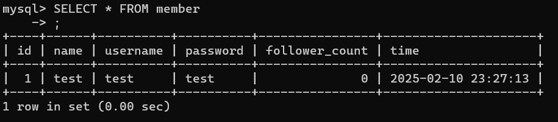 
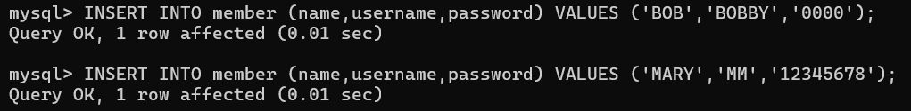 
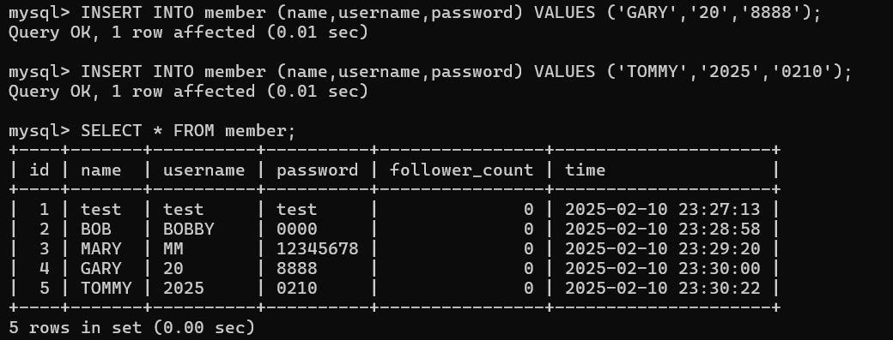 
2. SELECT all rows from the member table. 
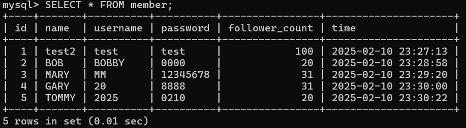 
3. SELECT all rows from the member table, in descending order of time. 
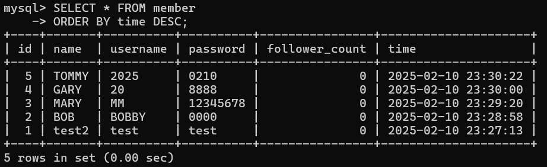 
4. SELECT total 3 rows, second to fourth, from the member table, in descending order of time. Note: it does not mean SELECT rows where id are 2, 3, or 4. 
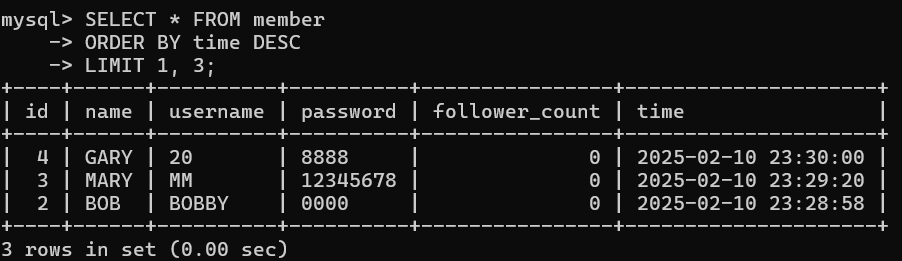 
5. SELECT rows where username equals to test. 
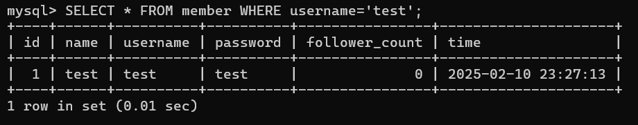 
6. SELECT rows where name includes the es keyword. 
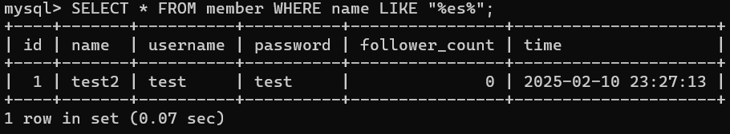 
7. SELECT rows where both username and password equal to test. 
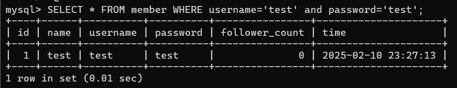 
8. UPDATE data in name column to test2 where username equals to test. 
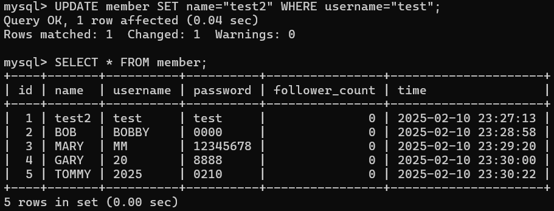 
  
    

# 😎 Task 4: SQL Aggregation Functions
  

1. SELECT how many rows from the member table. 
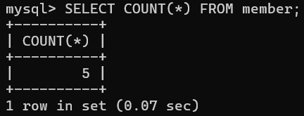 
2. SELECT the sum of follower_count of all the rows from the member table. 
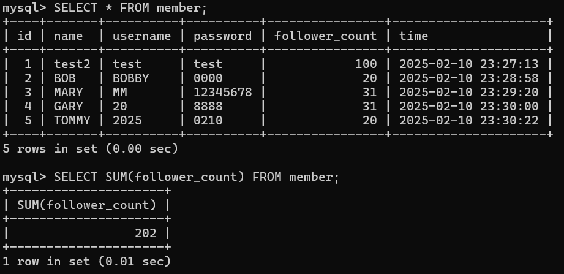 
3. SELECT the average of follower_count of all the rows from the member table. 
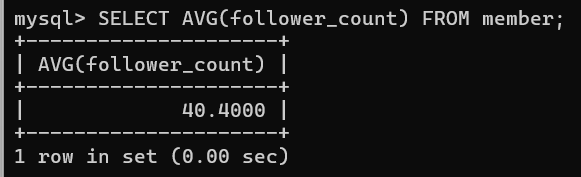 
4. SELECT the average of follower_count of the first 2 rows, in descending order of follower_count, from the member table. 
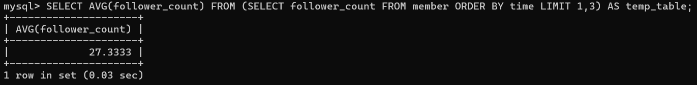 

# 😎 Task 5: SQL JOIN
  
  
1. Create a new table named message, in the website database. designed as below:  
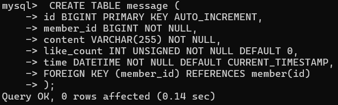 
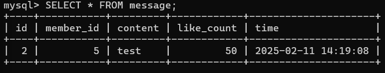 
2. SELECT all messages, including sender names. We have to JOIN the member table to get that. 
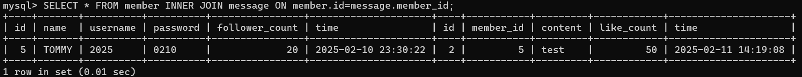 
3. SELECT all messages, including sender names, where sender username equals to test. We have to JOIN the member table to filter and get that. 
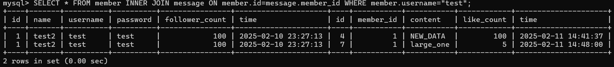 
4. Use SELECT, SQL Aggregation Functions with JOIN statement, get the average like count of messages where sender username equals to test. 
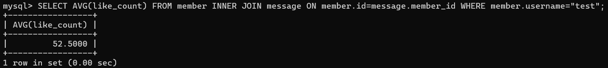 
5. Use SELECT, SQL Aggregation Functions with JOIN statement, get the average like count of messages GROUP BY sender username. 
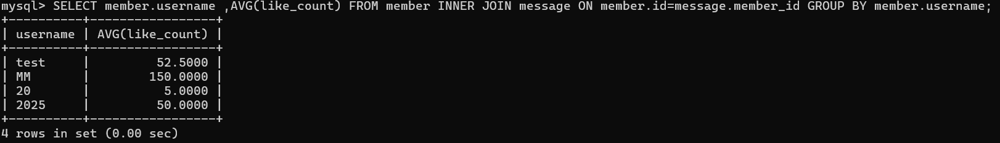 
